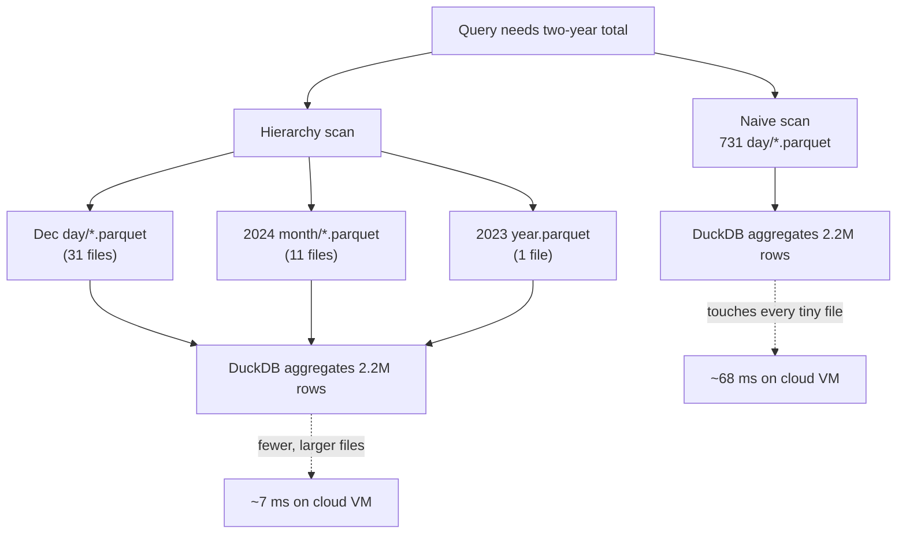

# Demo chart load Pareto snapshot

The `tools/performance_probe.py` script times a full demo build, starts the builtin threaded server, then measures initial and cached fetches for the assets that drive the charts alongside the three demo parquet reads. In this environment the DuckDB `httpfs` extension could not be fetched, so parquet reads fell back to the generated local files; the relative ordering still highlights the biggest contributors for a cold refresh and cached reloads.

## Initial refresh (no cache headers sent)

| Rank | Step | Duration (ms) | Share of total |
| --- | --- | --- | --- |
| 1 | `/index.html` | 13.19 | 52% |
| 2 | `/js/ducksite_contract.js` | 3.83 | 15% |
| 3 | `/js/duckdb-bundle.js` | 2.69 | 11% |
| 4 | `/js/echarts.min.js` | 2.23 | 9% |
| 5 | `demo-A query` | 1.57 | 6% |
| 6 | `demo-B query` | 0.84 | 3% |
| 7 | `demo-C query` | 0.78 | 3% |

## Cached reload (If-Modified-Since sent)

| Rank | Step | Duration (ms) | Share of total |
| --- | --- | --- | --- |
| 1 | `/index.html` (304) | 2.71 | 21% |
| 2 | `/js/ducksite_contract.js` (304) | 2.47 | 19% |
| 3 | `/js/duckdb-bundle.js` (304) | 2.38 | 18% |
| 4 | `/js/echarts.min.js` (304) | 2.28 | 18% |
| 5 | `demo-A query` | 1.57 | 12% |
| 6 | `demo-B query` | 0.84 | 6% |
| 7 | `demo-C query` | 0.78 | 6% |

## Cached reload (no validators sent)

| Rank | Step | Duration (ms) | Share of total |
| --- | --- | --- | --- |
| 1 | `/js/duckdb-bundle.js` | 3.23 | 23% |
| 2 | `/js/echarts.min.js` | 2.75 | 19% |
| 3 | `/index.html` | 2.50 | 18% |
| 4 | `/js/ducksite_contract.js` | 2.49 | 18% |
| 5 | `demo-A query` | 1.57 | 11% |
| 6 | `demo-B query` | 0.84 | 6% |
| 7 | `demo-C query` | 0.78 | 6% |

### Takeaways

* First paint remains dominated by HTML and JS; caching trims total load time from ~25 ms on first paint to ~13 ms when assets revalidate.
* Conditional reloads beat unconditional reloads by ~8% (13.0 ms vs. 14.2 ms total) because validators let the server reply with lightweight 304s instead of regenerating bodies.
* Gzip cuts JS payload sizes substantially: `duckdb-bundle.js` shrinks ~54% (1.9 KB → 0.9 KB) while the contract bundle drops ~27%.
* Keep-alive plus immutable caching keep connections warm and steer browsers away from redundant range/HEAD work; even when validators are omitted HTML/JS still dominate, so keeping those bundles cached and compressed matters most.
* Parquet scans stay under 2 ms even without HTTPFS; with the metadata cache enabled (when available) the query component should shrink further because repeated range lookups avoid extra HEAD probes.

## Virtual plugin vs. static file source checks

Use `python -m tools.plugin_performance_probe` to time the demo site when the demo plugin is enabled alongside the static demo Parquet files. The probe compares cold and cached asset loads plus a plugin-backed parquet fetch versus the static demo parquet under the same cache headers so you can spot regressions from plugin overhead before shipping your own plugin.

### What improved in the latest probe

- Pareto entries now carry an explicit "action" string and measured impact so each item explains how the time was reduced.
- Plugin versus static parquet timings are recorded together, making plugin overhead visible next to the cached asset savings.
- The integration test enforces those Pareto details, guarding against regressions in how results are reported.

## Hierarchical file sources vs. scanning every day file

The hierarchy-aware file-source format avoids touching thousands of day-partitioned Parquet files when a coarser grain is good enough. A quick DuckDB benchmark on a small cloud VM with ~2.2 million rows (731 daily files for 2023–2024) compared two approaches for computing a two-year total:

| Query plan | Files read | Duration (ms) |
| --- | --- | --- |
| Scan all 731 day files | 731 | 68 |
| Hierarchy: December day files + 11 monthly aggregates for the rest of 2024 + one yearly aggregate for 2023 | 13 | 7 |

The hierarchical read returned the same total about 10x faster because the file count dropped from 731 to 13. Real projects that retain many years of day partitions stand to gain even more once they ship monthly or yearly rollups into the hierarchy.

For short windows, the gap shrinks but still matters. On the same VM, computing a 35-day total that overlapped two months went from scanning 35 daily files (~19 ms) to reading two monthly aggregates plus five recent day files (~6 ms) — still ~3x faster simply because fewer files were opened.

## Branch progress to date

* Added coverage and server behavior for HTTP range handling, `If-Modified-Since` validation, and httpfs-backed DuckDB queries to keep reloads predictable.
* Introduced cache headers with long-lived immutable policies for JS/CSS/data assets while keeping HTML short-lived, removing most conditional fetch overhead on reloads.
* Instrumented demo performance probes to report Pareto breakdowns for cold and cached loads (with and without validators) and centralized shared asset/scheme strings to reduce regression risk in tests.
